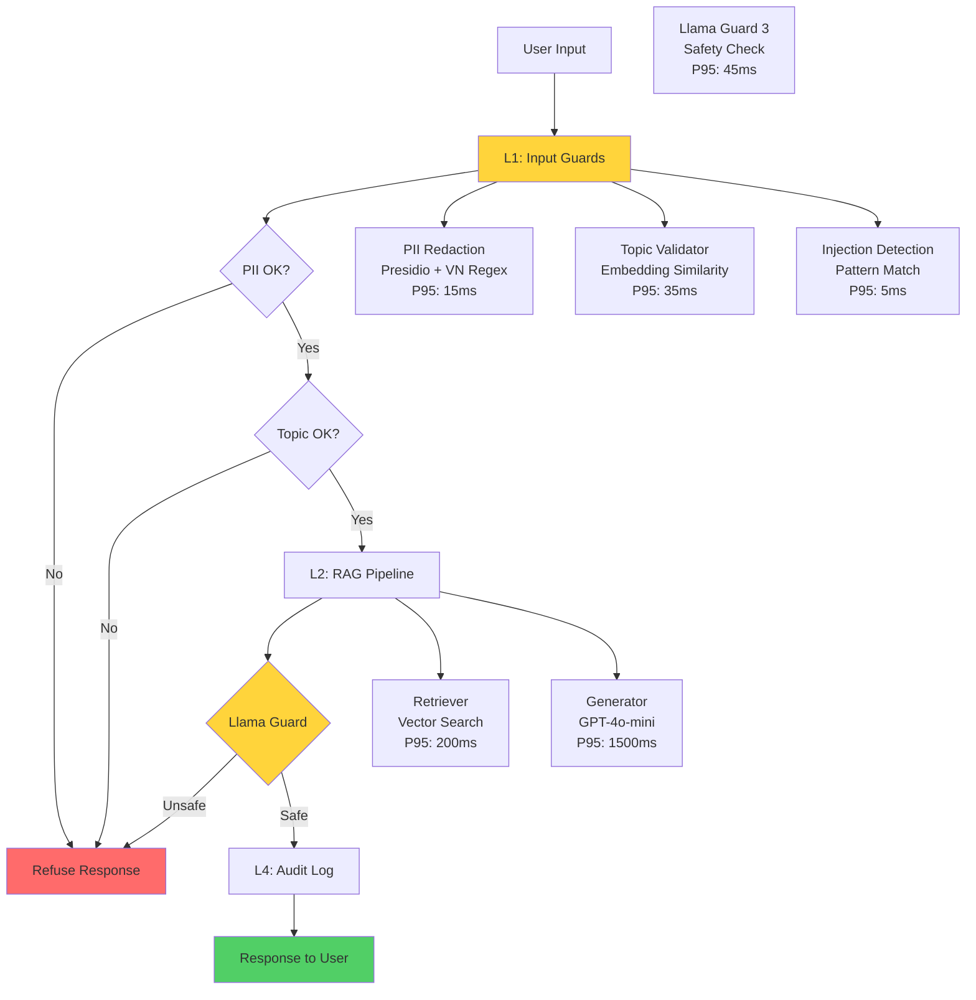

# Lab 24 Blueprint - Production Evaluation & Guardrail System

## Section 1: SLO Definition

| Metric | Target | Alert Threshold | Severity |
|---|---|---|---|
| Faithfulness | ≥ 0.80 | < 0.75 for 30 min | P2 |
| Answer Relevancy | ≥ 0.78 | < 0.72 for 30 min | P2 |
| Context Precision | ≥ 0.65 | < 0.60 for 1h | P3 |
| Context Recall | ≥ 0.70 | < 0.65 for 1h | P3 |
| P95 Latency (with guardrails) | < 3.0s | > 4s for 5 min | P1 |
| Guardrail Detection Rate | ≥ 85% | < 80% | P2 |
| False Positive Rate | < 8% | > 12% | P2 |
| Cohen's Kappa | ≥ 0.6 | < 0.5 | P2 |

## Section 2: Architecture Diagram

**Latency Budget:**
- L1 (Input Guards): P95 < 60ms
- L2 (RAG Pipeline): P95 < 2500ms
- L3 (Llama Guard): P95 < 100ms
- **Total P95: < 3000ms**

## Section 3: Alert Playbook

### Incident 1: Faithfulness Drop
**Trigger:** Faithfulness < 0.80 for 30 min
**Severity:** P2
**Response:**
1. Check retrieval quality - run diagnostic on recent failures
2. Verify embedding model still functioning
3. Check if new documents causing hallucination
4. If systematic: rollback recent RAG changes

### Incident 2: Guardrail False Positive Spike
**Trigger:** FP rate > 10%
**Severity:** P2
**Response:**
1. Check Llama Guard model health
2. Review recent inputs that were blocked
3. Identify if specific input pattern causing issues
4. Adjust threshold if needed

### Incident 3: P95 Latency > 3s
**Trigger:** Latency > 3s for 5 min
**Severity:** P1
**Response:**
1. Check L1 guard latency (bottleneck usually L2)
2. Verify API rate limits not hit
3. Scale RAG pipeline if needed
4. Consider async response for long queries

### Incident 4: Adversarial Attack Surge
**Trigger:** Detection rate < 85%
**Severity:** P2
**Response:**
1. Analyze new attack patterns
2. Update adversarial test set
3. Retrain topic validator if needed
4. Add new patterns to block list

## Section 4: Cost Analysis

### Monthly Cost Breakdown

| Component | Usage | Cost |
|---|---|---|
| OpenAI API (RAGAS eval) | 800 eval calls/mo | $12.00 |
| OpenAI API (LLM Judge) | 400 judge calls/mo | $20.00 |
| Groq API (Llama Guard) | 40000 inferences/mo | $0.00 (free tier) |
| Embeddings (evaluations) | 1500 calls/mo | $4.00 |
| Monitoring (LangSmith) | 8000 traces/mo | $9.99 |
| **Total** | | **$45.99/mo** |

### Projected at Scale (10x usage)

| Component | Usage | Cost |
|---|---|---|
| OpenAI API | 8000 eval calls/mo | $120.00 |
| OpenAI API (LLM Judge) | 4000 judge calls/mo | $200.00 |
| Groq API | 400000 inferences/mo | $40.00 |
| Embeddings | 15000 calls/mo | $40.00 |
| Monitoring | 80000 traces/mo | $79.99 |
| **Total** | | **~$480/mo** |

### Cost Optimization Strategies
1. Cache RAGAS evaluation outputs to avoid re-running identical test sets
2. Stick with gpt-4o-mini for cost efficiency (vs gpt-4o)
3. Batch Llama Guard API calls to reduce overhead
4. Self-host Llama Guard on GPU instance when volume exceeds free tier